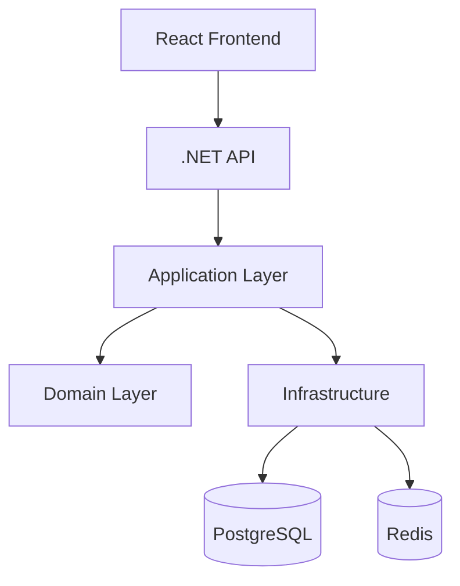

# CodeDialect

> Open-source platform for cross-language coding challenges, syntax evolution, and ecosystem comparison.

**CodeDialect** helps developers understand how different programming languages, frameworks, and runtime versions express the same software concepts. It is designed to help developers master evolving ecosystems by solving challenges and comparing implementations across different languages and framework versions (e.g., C# .NET 8 vs .NET 10, Java 8 vs 21).

Instead of focusing only on algorithms, CodeDialect emphasizes:

* modern syntax evolution
* ecosystem migration
* idiomatic implementations
* version-to-version comparisons
* real-world software patterns

Examples include:

* C# .NET Framework → .NET 10
* Java 8 → Java 21
* React class components → Hooks
* JavaScript → TypeScript
* AngularJS → Modern Angular
* Node.js CommonJS → ES Modules

---

# 🚀 Vision

Software ecosystems evolve rapidly, and developers often struggle to:

* modernize legacy syntax
* learn newer framework patterns
* compare idiomatic implementations across languages
* understand how ecosystems solve similar problems differently

CodeDialect aims to become a platform for:

* syntax modernization
* ecosystem comparison
* developer education
* coding challenges
* language evolution tracking

---

# ✨ Core Features

## Multi-Language Coding Challenges

Solve challenges using multiple programming languages and framework ecosystems.

## Version-Aware Comparisons

Compare implementations across runtime and framework versions:

* .NET 8 vs .NET 10
* Java 8 vs Java 21
* React legacy vs modern patterns

## Side-by-Side Syntax Viewer

Visualize ecosystem differences with synchronized comparison views.

## Monaco-Powered Editor

Professional-grade editing experience using the VSCode Monaco Editor.

## Challenge Categories

Support for:

* Front-End
* Back-End
* Full Stack
* DevOps
* Databases
* APIs
* Cloud
* Security
* Architecture

## Extensible Execution Engine

Architecture designed for isolated containerized execution and benchmarking.

---

# 🏗️ Architecture

CodeDialect follows **Clean Architecture** principles with strong separation of concerns, modularity, and testability.

## High-Level Architecture



## Layers

### Domain
Pure business entities, enums, and domain logic. No dependencies on other layers.

### Application
Application use cases, CQRS Commands/Queries, DTOs, Validation, and orchestration.

### Infrastructure
External implementations and integrations (EF Core, Redis, Execution Runners).

### WebAPI
Application entry point (Controllers, Middleware, OpenAPI/Swagger).

---

# 🚀 Tech Stack

## Backend

* .NET 10 (ASP.NET Core Web API)
* Clean Architecture + CQRS (MediatR)
* Entity Framework Core (PostgreSQL)
* Redis
* JWT Authentication
* Swagger / OpenAPI

## Frontend

* React 18+ (Vite)
* TypeScript
* Tailwind CSS v4
* Monaco Editor
* Zustand
* TanStack Query

## Infrastructure

* Docker & Docker Compose
* Environment-based configuration

---

# 🔒 Planned Code Execution Model

CodeDialect is being architected to support secure isolated execution using containerized runners.

Planned capabilities include:

* Docker-based sandboxing
* Execution timeouts
* Memory limits
* Runtime benchmarking
* Multi-language runners
* Compile/run pipelines
* Execution telemetry

---

# 🛠️ Getting Started

## Prerequisites

* .NET 10 SDK
* Node.js 18+
* Docker & Docker Compose

---

### Quick Start

We use `concurrently` via the root `package.json` to orchestrate everything natively:

1. **Install Dependencies**
   ```bash
   npm run install:all
   ```

2. **Start Infrastructure Services**
   ```bash
   npm run dev:infra
   ```

3. **Start Development Environment**
   ```bash
   npm run dev
   ```
   *This starts both the .NET API and React Vite Frontend with hot-reloading.*

---

# 🧩 MVP Features

* Authentication & Authorization
* Challenge Explorer
* Challenge Categories
* Syntax Comparison Viewer
* Monaco Editor Integration
* Progress Tracking Dashboard
* Challenge Difficulty Levels
* Multi-Version Challenge Support
* Clean Architecture Backend
* Docker-Based Local Development

---

# 🗺️ Roadmap

## Phase 1

* Core platform
* Authentication
* Challenge management
* Syntax comparison viewer
* Multi-language metadata

## Phase 2

* Secure code execution
* Benchmarking
* Runtime comparisons
* Scoring engine
* Submission history

## Phase 3

* AI-assisted feedback
* Idiomatic scoring
* Migration assistance
* Team/organization support
* Real-time collaboration

---

# 🤝 Contributing

Contributions are welcome. Please read `CONTRIBUTING.md` for details on our code of conduct and the process for submitting pull requests.

---

# 📄 License

This project is licensed under the MIT License.
