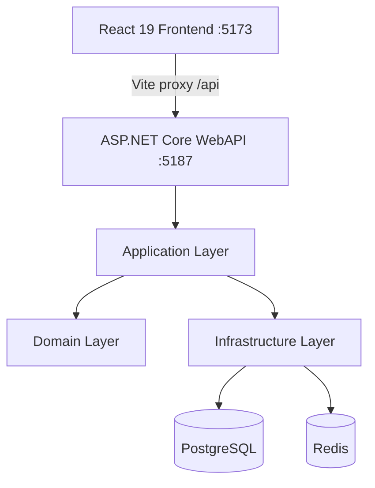

# CodeDialect

> Side-by-side coding challenges for language dialects, syntax evolution, and ecosystem comparison.

**CodeDialect** helps developers understand how the same software concept is expressed across different programming languages, framework versions, and runtime generations. Instead of algorithm puzzles, challenges focus on real-world patterns and the evolution of language idioms.

Examples of challenges included today:

| Legacy | Modern |
|---|---|
| .NET Framework 4.8 controllers | .NET 10 Minimal APIs |
| Java 8 thread pools | Java 21 Virtual Threads |
| JavaScript callbacks (ES5) | async/await (ES2023) |
| Python 2.7 dicts | Python 3.12 dataclasses |

---

## What's Working

- Challenge explorer with paginated list, difficulty filter, and category labels
- Side-by-side comparison viewer (Monaco Editor, synchronized scroll)
- Diff view between dialect implementations
- Reveal/hide reference solution toggle
- Dialect selector when a challenge has more than two implementations
- Per-side syntax highlighting (each editor uses its language's grammar)
- Submit code endpoint (returns 202 Accepted; execution engine is a stub)
- Seed data: 6 challenges across C#, Java, JavaScript, TypeScript, and Python

## Not Yet Implemented

- Auth UI (login / register pages — JWT backend is wired, no frontend flow)
- Code execution runner (Docker-sandboxed grading)
- Benchmarking and scoring
- EF Core migrations (dev uses `EnsureCreated` with InMemory DB)
- Tests

---

## Architecture

Clean Architecture with CQRS, strict layer boundaries, and no upward dependencies.

```
Domain        — entities, enums, value objects (no external deps)
Application   — CQRS handlers, DTOs, interfaces, validation behaviors
Infrastructure — EF Core, Identity, JWT, Redis, execution stub
WebAPI        — controllers, middleware, Swagger, program entry
```



### Key design decisions

- **MediatR 14 pipeline**: `ValidationBehavior<TRequest,TResponse>` runs FluentValidation before every command handler
- **Score as owned type**: `Score` is embedded in the `Submission` table via EF Core `OwnsOne` — not a separate entity
- **ComparisonImplementation junction table**: `Comparison` references implementations via a proper FK junction (not a raw `List<Guid>`)
- **IEntityTypeConfiguration classes**: One class per entity in `Infrastructure/Persistence/Configurations/`; `OnModelCreating` is a single `ApplyConfigurationsFromAssembly` call
- **JSON value converters**: `List<string>` and `Dictionary<string,string>` fields use JSON converters that work across InMemory and PostgreSQL providers
- **ICurrentUserService**: User identity is resolved from `IHttpContextAccessor` in Infrastructure; the Application layer only sees the interface
- **Global exception handler**: `GlobalExceptionHandler : IExceptionHandler` maps `ValidationException` → 400, `NotFoundException` → 404, `UnauthorizedAccessException` → 401

---

## Tech Stack

### Backend
| | |
|---|---|
| Runtime | .NET 10 |
| Framework | ASP.NET Core Web API |
| Architecture | Clean Architecture + CQRS |
| Mediator | MediatR 14 |
| Validation | FluentValidation 12 |
| ORM | Entity Framework Core 10 |
| Database | PostgreSQL (prod) / InMemory (dev) |
| Cache | Redis (prod) / DistributedMemoryCache (dev) |
| Auth | ASP.NET Core Identity + JWT Bearer |
| API docs | Swashbuckle / OpenAPI (Swagger UI with Bearer auth) |

### Frontend
| | |
|---|---|
| Framework | React 19 + TypeScript 6 |
| Build tool | Vite 8 |
| Styling | Tailwind CSS v4 |
| Editor | Monaco Editor (`@monaco-editor/react`) |
| Data fetching | TanStack Query v5 + Axios |
| Routing | React Router v7 |
| Animation | Framer Motion |
| State | Zustand |

---

## Getting Started

### Prerequisites

- [.NET 10 SDK](https://dotnet.microsoft.com/download)
- [Node.js 20+](https://nodejs.org/)
- [Docker Desktop](https://www.docker.com/products/docker-desktop/) (optional — only needed for PostgreSQL/Redis)

### Install all dependencies

```bash
npm run install:all
```

### Development (InMemory DB — no Docker required)

The API defaults to an in-memory database in development. No external services needed.

```bash
npm run dev
```

This starts both the API (`http://localhost:5187`) and the web app (`http://localhost:5173`) with hot-reload. The Vite dev server proxies `/api` to the API automatically.

Swagger UI is available at `http://localhost:5187/swagger`.

### Development with PostgreSQL + Redis

```bash
# 1. Start infrastructure services
npm run dev:infra

# 2. Set UseInMemoryDatabase to false in appsettings.Development.json
# 3. Start the dev servers
npm run dev
```

### Environment variables

| Variable | Description | Required in |
|---|---|---|
| `JwtSettings__Secret` | JWT signing key (min 32 chars) | Production |
| `ConnectionStrings__DefaultConnection` | PostgreSQL connection string | Production |
| `ConnectionStrings__Redis` | Redis connection string | Production |

In development these are set in `apps/api/CodeDialect.WebAPI/appsettings.Development.json`. **Never commit production secrets.**

---

## Project Structure

```
CodeDialect/
├── apps/
│   ├── api/
│   │   ├── CodeDialect.Domain/          # Entities, enums, value objects
│   │   ├── CodeDialect.Application/     # CQRS, DTOs, interfaces, validators
│   │   ├── CodeDialect.Infrastructure/  # EF Core, Identity, services
│   │   └── CodeDialect.WebAPI/          # Controllers, middleware, Program.cs
│   └── web/                             # React + TypeScript frontend
├── docker/
│   ├── docker-compose.infra.yml         # PostgreSQL + Redis only
│   ├── docker-compose.yml               # Full stack
│   └── Dockerfile.api
├── infrastructure/                      # Future: Terraform, K8s, CI/CD
└── docker-compose.yml                   # Root convenience compose
```

---

## Roadmap

### Phase 1 — Core (in progress)
- [x] Challenge explorer with pagination and filtering
- [x] Side-by-side comparison viewer
- [x] Monaco Editor with per-dialect syntax highlighting
- [x] CQRS + validation pipeline
- [x] JWT auth backend
- [ ] Auth UI (login / register)
- [ ] User submission history

### Phase 2 — Execution
- [ ] Docker-sandboxed code runner
- [ ] Execution telemetry (time, memory)
- [ ] Scoring engine
- [ ] Benchmarking comparisons

### Phase 3 — Intelligence
- [ ] AI-assisted feedback on submissions
- [ ] Idiomatic pattern scoring
- [ ] Migration path suggestions

---

## Contributing

See [CONTRIBUTING.md](CONTRIBUTING.md) for guidelines on architecture, code style, and the pull request process.

## License

MIT
