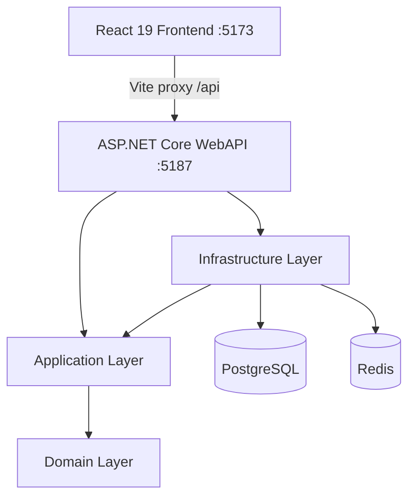

# CodeDialect

> Side-by-side coding challenges for language dialects, syntax evolution, and ecosystem comparison.

**CodeDialect** helps developers understand how the same software concept is expressed across different programming languages, framework versions, and runtime generations. Instead of algorithmic puzzles, challenges focus on real-world patterns, modern syntax idioms, and performance evolution.

### Comparison Examples

| Paradigm / Legacy | Modern Equivalent | Dialects Compared |
| :--- | :--- | :--- |
| **Controller Routing** | Minimal APIs | .NET Framework 4.8 vs. .NET 10 |
| **Thread Pools** | Virtual Threads (Loom) | Java 8 vs. Java 21 |
| **Callback Chains** | Async / Await | ES5 JavaScript vs. ES2023 JS (ESM) |
| **Manual DI Constructors**| Primary Constructors | .NET Framework 4.8 vs. .NET 10 |
| **Raw Dictionaries** | Dataclasses | Python 2.7 vs. Python 3.12 |
| **Dynamic Responses** | Discriminated Unions | TypeScript 5.x |

---

## ⚡ Key Features & What's Working

- 📂 **Challenge Explorer**: Paginated challenge lists, difficulty tagging, category filters, and search index.
- 🔄 **Comparison Viewer**: Side-by-side code pane built with Monaco Editor including synchronized scrolling.
- 🔀 **Diff Visualizer**: Real-time git-style diff view comparing the evolution between dialects.
- 👁️ **Solution Toggle**: Reveal or hide the reference solution on both panes instantly.
- 🎛️ **Multi-Dialect Selector**: Swap active dialects when a challenge has more than two implementations.
- 🎨 **Language-Specific Grammars**: Independent, context-aware syntax highlighting for each active pane.
- ⚙️ **Modular Backend**: Fully-structured REST API with CQRS commands, pipeline validation, and standard HTTP handlers.
- 🌱 **Rich Seeding**: Automatic DB seeding with 6 real-world challenges across C#, Java, JavaScript, TypeScript, and Python.
- ⚙️ **Settings Page**: Profile, appearance (theme, glassmorphism intensity), and editor preference panels.

---

## 🛠️ Tech Stack

### Back-End Architecture
- **Runtime & SDK**: .NET 10
- **Framework**: ASP.NET Core Web API
- **Design Pattern**: Clean Architecture + CQRS (MediatR 14)
- **Validation**: FluentValidation 12 (Pipeline Behavior)
- **Data Access**: Entity Framework Core 10
- **Database**: PostgreSQL (prod) / EF Core InMemory Provider (dev fallback)
- **Caching**: Redis (prod) / DistributedMemoryCache (dev fallback)
- **Authentication**: ASP.NET Core Identity & JWT Bearer tokens
- **Documentation**: Swagger / OpenAPI (Swashbuckle) with Bearer token authentication

### Front-End Application
- **Framework & Language**: React 19 + TypeScript 6
- **Build Engine**: Vite 8
- **Styling**: Tailwind CSS v4
- **Code Editor**: Monaco Editor (`@monaco-editor/react`)
- **Data Fetching**: TanStack Query v5 + Axios
- **Routing**: React Router v7
- **Animations**: Framer Motion
- **State Management**: Zustand

---

## 🏗️ Architecture Design

CodeDialect uses Clean Architecture with CQRS, enforcing strict layer boundaries:

```
Domain         — Entities, Enums, Value Objects. Zero external dependencies.
Application    — CQRS handlers, DTOs, repository interfaces, validation pipeline.
                 Framework-free: no EF Core, no ORM. Depends only on Domain.
Infrastructure — EF Core repositories, DbContext, Identity, JWT, Redis, execution stubs.
                 Implements Application interfaces; owns all framework dependencies.
WebAPI         — Controllers, Swagger, Global Exception Middleware, program entry.
```

### Dependency Flow



---

## 🚀 Getting Started

### Prerequisites
- **[.NET 10 SDK](https://dotnet.microsoft.com/download)**
- **[Node.js 20+](https://nodejs.org/)**
- **[Docker Desktop](https://www.docker.com/products/docker-desktop/)** *(optional - only required for running PostgreSQL/Redis)*

### 1. Install Dependencies
Run the utility script to restore NuGet packages and install Node packages in one command:
```bash
npm run install:all
```

### 2. Run in Development Mode (InMemory Database)
By default, the development environment runs with an InMemory database. No external databases or Docker containers are required.
```bash
npm run dev
```
- **Web App**: [http://localhost:5173](http://localhost:5173)
- **Swagger Documentation**: [http://localhost:5187/swagger](http://localhost:5187/swagger)

> [!NOTE]
> The Vite dev server automatically proxies requests starting with `/api` to the backend running at `http://localhost:5187`.

### 3. Run with PostgreSQL + Redis
To run with a persistent store and caching layer:
```bash
# Start PostgreSQL & Redis containers
npm run dev:infra

# Set "UseInMemoryDatabase" to false in apps/api/CodeDialect.WebAPI/appsettings.Development.json
# Then start the servers:
npm run dev
```

---

## 📁 Project Structure

```
CodeDialect/
├── apps/
│   ├── api/
│   │   ├── CodeDialect.Domain/          # Domain models (Entities, Enums, Common base)
│   │   ├── CodeDialect.Application/     # CQRS features, Behaviors, DTOs, Interfaces
│   │   ├── CodeDialect.Infrastructure/  # EF Core, AppDbContext, Configurations, Identity, Seed Data
│   │   └── CodeDialect.WebAPI/          # Controllers, Program.cs, Middleware, Configs
│   ├── runner/                          # Code execution runner service (scaffold — in progress)
│   └── web/                             # React 19 SPA + Tailwind CSS + Monaco Editor
├── challenges/                          # JSON challenge definition schemas
├── docker/
│   ├── docker-compose.infra.yml         # Dev services (PostgreSQL + Redis)
│   ├── docker-compose.yml               # Complete containerized stack
│   └── Dockerfile.api                   # Multistage build script for WebAPI
├── docs/
│   ├── adr/                             # Architecture Decision Records
│   └── architecture/                    # System design documents
├── infrastructure/                      # IaC placeholder (Terraform, K8s, CI/CD — planned)
├── protos/
│   └── execution.proto                  # gRPC service contract for the execution runner
├── scripts/                             # Dev automation (setup, run, stop)
└── docker-compose.yml                   # Root orchestration file
```

---

## 🗺️ Roadmap & Current Status

### Phase 1 — Core (In Progress)
- [x] Challenge explorer with pagination and filtering
- [x] Side-by-side comparison viewer
- [x] Monaco Editor with per-dialect syntax highlighting
- [x] CQRS + validation pipeline
- [x] JWT auth backend
- [ ] Auth UI (login / register pages)
- [ ] User submission history
- [ ] Wire search bar and difficulty filter to the API (UI rendered; query params not yet sent)
- [ ] Pagination controls on the challenge list (API returns `hasNextPage` / `hasPreviousPage`; frontend doesn't render page controls)
- [ ] Connect "Run Benchmark" button to the submission endpoint (button is rendered; `onClick` not implemented)
- [ ] Submission status polling — surface `Processing → Completed / Failed / TimedOut` states in the UI
- [ ] EF Core migrations to replace `EnsureCreated` (required before any persistent deployment)
- [ ] Category filter on the challenge list API and UI

### Phase 2 — Execution
- [x] gRPC execution service contract defined (`protos/execution.proto`)
- [ ] Docker-sandboxed code runner (`apps/runner` scaffold in place)
- [ ] Execution telemetry (execution time, memory footprint)
- [ ] Scoring engine (Score value object already modelled in the domain)
- [ ] Benchmarking comparisons

### Phase 3 — Intelligence
- [ ] AI-assisted feedback on submissions
- [ ] Idiomatic pattern scoring
- [ ] Migration path suggestions
- [ ] "Why this matters" narrative panels — contextual notes explaining the motivation behind each language evolution (e.g. why virtual threads replaced thread pools)
- [ ] Syntax evolution timeline — visualise the full dialect progression for a language rather than just pairwise comparison

### Phase 4 — Community
- [ ] User profiles with public completion history and stats
- [ ] Global leaderboard with difficulty-weighted ranking (dashboard stat card is already wired as a placeholder)
- [ ] Challenge bookmarking and personal reading lists (Star button rendered on each card; handler not yet implemented)
- [ ] Shareable permalink that preserves dialect selection and diff-vs-side-by-side view state
- [ ] Community-submitted challenges with an editor review and approval workflow
- [ ] Inline annotations and discussion threads on specific lines of an implementation

### Platform Foundations
- [ ] Test suite: unit tests for Application handlers + integration tests using Testcontainers + PostgreSQL
- [ ] GitHub Actions CI/CD pipeline with build and test gates
- [ ] Redis query caching for paginated challenge lists (cache layer registered in DI; no reads or writes yet)
- [ ] API rate limiting and abuse prevention
- [ ] Multi-file challenge mode for comparisons that span project structure (e.g. build config, entry point, dependency manifest)

---

## 🤝 Contributing & License

For guidelines on coding style, architectural principles, and pulling changes, please review [CONTRIBUTING.md](CONTRIBUTING.md).

This project is licensed under the **MIT License**.
